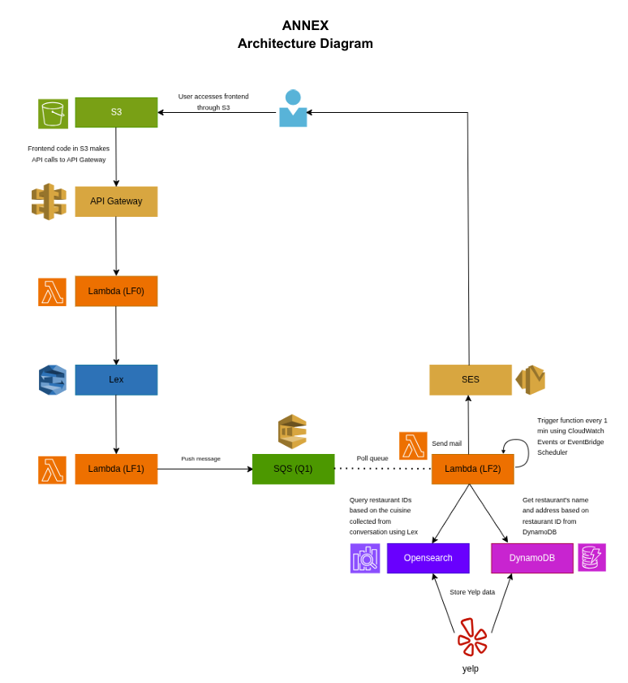

# Assignment 1 Dining Concierge Bot

**Cloud Computing and Big Data — Fall 2026**

Dining Concierge is a serverless restaurant recommendation chatbot built using AWS services. Users interact with a web-based chatbot, provide their dining preferences, and receive restaurant recommendations by email.

The application uses Amazon S3, API Gateway, AWS Lambda, Amazon Lex, Amazon SQS, Amazon OpenSearch Service, Amazon DynamoDB, Amazon SES, and Amazon EventBridge.

---

## Architecture



The application follows a serverless, event-driven architecture.

### 1. Amazon S3 — Frontend

The frontend of the Dining Concierge application is hosted as a static website using an **Amazon S3 bucket**.

The user opens the website and interacts with the chatbot through the browser.

The frontend sends the user's messages to the backend through Amazon API Gateway.

```text
User
 ↓
Amazon S3
 ↓
API Gateway
```

---

### 2. Amazon API Gateway

**Amazon API Gateway** provides the HTTP API used by the frontend.

When the frontend sends a chat message, API Gateway forwards the request to the first Lambda function, **LF0**.

```text
S3 Frontend
 ↓
API Gateway
 ↓
Lambda LF0
```

API Gateway therefore acts as the entry point between the web application and the serverless backend.

---

### 3. Lambda LF0

**LF0** acts as the API Lambda for the chatbot.

LF0 receives the user's message from API Gateway and sends the text to the Amazon Lex bot.

The response produced by Lex is then returned through LF0 and API Gateway to the frontend.

```text
Frontend
 ↓
API Gateway
 ↓
LF0
 ↓
Amazon Lex
```

LF0 allows the frontend to communicate with the Lex chatbot without interacting with Lex directly.

---

### 4. Amazon Lex

**Amazon Lex** manages the conversation with the user.

The bot contains the intents used by the Dining Concierge application, including:

- Greet
- Suggest
- Thank

For a restaurant recommendation request, Lex collects the information required for the search:

- Location
- Cuisine
- Dining date
- Dining time
- Number of people
- Email address

The supported restaurant location is Manhattan.

The supported cuisines are:

- American
- Italian
- Japanese
- Chinese
- Pizza

Lex invokes **LF1** as its Lambda code hook so that the application can validate the user's input and process completed restaurant searches.

---

### 5. Lambda LF1

**LF1** handles validation and fulfillment logic for the Lex chatbot.

LF1 performs tasks such as:

- Validating that the requested location is Manhattan
- Validating that the requested cuisine is supported
- Determining whether all required slots have been collected
- Sending completed dining requests to Amazon SQS
- Checking previous searches for the extra-credit feature

For a normal new restaurant request, LF1 creates a message containing the user's dining information and sends it to the SQS queue.

```text
Lex
 ↓
LF1
 ↓
Amazon SQS
```

The chatbot can then immediately tell the user that the request was received while restaurant recommendation processing happens asynchronously.

---

### 6. Amazon SQS

The application uses an Amazon SQS standard queue named:

```text
food_info
```

SQS decouples the chatbot from the restaurant recommendation worker.

A completed request contains information such as:

```text
Location
Cuisine
Date
Time
Number of people
Email
```

Instead of making the user wait while restaurants are searched and an email is sent, LF1 places the request into SQS and completes the Lex conversation.

LF2 later retrieves and processes the queued request.

```text
LF1
 ↓
SQS
 ↓
LF2
```

---

### 7. Amazon EventBridge Scheduler

**Amazon EventBridge Scheduler** invokes **LF2 every minute**.

The schedule is configured using:

```text
rate(1 minute)
```

LF2 acts as a queue worker. Each time EventBridge invokes LF2, the function checks the SQS queue for a pending dining request.

If the queue is empty, LF2 exits normally.

If a request exists, LF2 processes it and removes the message from SQS after successful completion.

```text
EventBridge
     ↓
    LF2
     ↓
 Poll SQS
```

---

### 8. Lambda LF2

**LF2** is the restaurant recommendation worker.

For each request pulled from SQS, LF2:

1. Reads the user's cuisine and other dining information.
2. Searches OpenSearch for restaurants matching the requested cuisine.
3. Randomly selects three restaurant IDs.
4. Retrieves the full restaurant information from DynamoDB.
5. Formats the restaurant recommendations.
6. Sends the recommendations to the user's email using Amazon SES.
7. Stores the recommendations in the user-state DynamoDB table for the extra-credit feature.
8. Deletes the successfully processed SQS message.

The normal recommendation flow is therefore:

```text
SQS
 ↓
LF2
 ├──→ OpenSearch
 │       ↓
 │   Restaurant IDs
 │
 ├──→ DynamoDB
 │       ↓
 │   Full restaurant details
 │
 └──→ Amazon SES
         ↓
       Email
```

---

## OpenSearch

Amazon OpenSearch Service is used to efficiently search restaurants based on cuisine.

The OpenSearch index is:

```text
restaurants
```

The Elasticsearch type is:

```text
Restaurant
```

OpenSearch stores only the information needed to perform restaurant lookup:

- `RestaurantID`
- `Cuisine`

There are **1,000 restaurant documents** in OpenSearch.

The cuisine distribution is:

| Cuisine | Restaurants |
|---|---:|
| American | 200 |
| Italian | 200 |
| Japanese | 200 |
| Chinese | 200 |
| Pizza | 200 |
| **Total** | **1,000** |

LF2 searches OpenSearch using the cuisine selected by the user and randomly selects three matching restaurant IDs.

The full restaurant information is then retrieved from DynamoDB.

---

## DynamoDB Restaurant Database

The main restaurant table is:

```text
yelp-restaurants
```

The partition key is:

```text
business_id
```

DynamoDB stores the complete restaurant information required to construct the recommendation email.

Each restaurant record contains:

- Business ID
- Name
- Cuisine
- Address
- Coordinates
- Number of Reviews
- Rating
- Zip Code
- `insertedAtTimestamp`

OpenSearch and DynamoDB therefore serve different purposes:

```text
OpenSearch
RestaurantID + Cuisine
        ↓
   Fast lookup
        ↓
Restaurant ID
        ↓
DynamoDB
        ↓
Full restaurant information
```

---

## Final Restaurant Dataset

`manhattan_restaurants_1000_final.json` contains **1,000 unique Manhattan restaurants**.

The dataset contains:

- 200 American restaurants
- 200 Italian restaurants
- 200 Japanese restaurants
- 200 Chinese restaurants
- 200 Pizza restaurants

Each restaurant record contains the information needed for both OpenSearch indexing and DynamoDB restaurant lookup.

---

## Amazon SES

**Amazon Simple Email Service (SES)** is used to deliver restaurant recommendations to the user.

After LF2 obtains three restaurants, it creates an email containing information such as:

- Restaurant name
- Address
- Rating
- Number of reviews

An example recommendation email has the following format:

```text
Hello!

Here are my Japanese restaurant suggestions for 2 people:

1. Restaurant A
   Address: ...
   Rating: ...
   Reviews: ...

2. Restaurant B
   Address: ...
   Rating: ...
   Reviews: ...

3. Restaurant C
   Address: ...
   Rating: ...
   Reviews: ...

Enjoy your meal!
```

The email address collected by the Lex chatbot is passed from LF1 through SQS to LF2 and is used as the recommendation recipient.

---

# Extra Credit — Persistent Recommendation State


The extra-credit implementation allows the Dining Concierge application to remember the user's previous restaurant search.

A second DynamoDB table is used:

```text
dining-user-state
```

The partition key is:

```text
email
```

Each user-state record stores:

- Email
- Previous location
- Previous cuisine
- Previous restaurant recommendations
- Last updated timestamp

Conceptually, a record contains:

```text
email
lastLocation
lastCuisine
lastRecommendations
updatedAt
```

---

## First Search

When a user performs a search for the first time, LF1 checks `dining-user-state` using the user's email address.

If no previous state exists, LF1 sends the request through the normal pipeline:

```text
Lex
 ↓
LF1
 ↓
SQS
 ↓
LF2
 ↓
OpenSearch
 ↓
DynamoDB
 ↓
SES
```

LF2 selects three restaurants and sends the recommendation email.

After successfully generating the recommendations, LF2 also stores the search in `dining-user-state`.

```text
LF2
 ↓
dining-user-state
```

The saved state contains the location, cuisine, and the exact restaurants recommended to the user.

---

## Returning User

When the same user performs another search, LF1 retrieves the user's previous state from DynamoDB.

LF1 compares:

```text
Current Location
        vs.
Previous Location

AND

Current Cuisine
        vs.
Previous Cuisine
```

If either the location or cuisine is different, the request is treated as a new search and sent to SQS normally.

If both are the same, LF1 asks:

```text
Would you like the same recommendations as last time?
```

---

## Reusing Previous Recommendations

If the user answers **Yes**, LF1 retrieves the previously stored restaurant recommendations from DynamoDB.

The request does not need to go through SQS, OpenSearch, or LF2 again.

Instead, LF1 directly sends the stored recommendations through Amazon SES.

```text
Lex
 ↓
LF1
 ├──→ dining-user-state
 │         ↓
 │   Previous restaurants
 │
 └──→ SES
        ↓
      Email
```

This path is represented by the additional arrows in the extra-credit architecture diagram.

---

## Requesting New Recommendations

If the user answers **No**, LF1 sends a new dining request to SQS.

The normal recommendation pipeline runs again:

```text
LF1
 ↓
SQS
 ↓
LF2
 ↓
OpenSearch
 ↓
DynamoDB
 ↓
SES
```

LF2 chooses a new set of restaurants and sends them to the user.

LF2 then updates `dining-user-state` with the newest location, cuisine, and restaurant recommendations.

The newly generated recommendations therefore become the recommendations offered during the user's next matching search.

---

## Complete Application Flow

The complete normal application architecture is:

```text
User
 ↓
S3 Frontend
 ↓
API Gateway
 ↓
Lambda LF0
 ↓
Amazon Lex
 ↓
Lambda LF1
 ↓
Amazon SQS
 ↓
EventBridge invokes LF2
 ↓
Lambda LF2
 ├──→ OpenSearch
 │       ↓
 │   Restaurant IDs
 │
 ├──→ DynamoDB
 │       ↓
 │   Restaurant details
 │
 ├──→ dining-user-state
 │       ↓
 │   Store previous recommendation
 │
 └──→ Amazon SES
         ↓
   Recommendation Email
```

For a returning user requesting the same location and cuisine:

```text
User
 ↓
Lex
 ↓
LF1
 ↓
dining-user-state
 ↓
Same search detected
 ↓
"Use the same recommendations?"
        ↓
   ┌────┴────┐
  Yes        No
   ↓          ↓
  SES        SQS
   ↓          ↓
Previous     LF2
Email         ↓
         New Recommendations
```

---

## AWS Services Used

| AWS Service | Purpose |
|---|---|
| Amazon S3 | Hosts the frontend |
| API Gateway | Exposes the chatbot API |
| AWS Lambda LF0 | Connects the frontend/API to Lex |
| Amazon Lex | Handles the chatbot conversation |
| AWS Lambda LF1 | Validates input, handles state, and sends requests to SQS |
| Amazon SQS | Decouples chatbot processing from recommendation processing |
| Amazon EventBridge Scheduler | Invokes LF2 every minute |
| AWS Lambda LF2 | Processes recommendation requests |
| Amazon OpenSearch Service | Searches restaurants by cuisine |
| Amazon DynamoDB | Stores complete restaurant data |
| Amazon DynamoDB `dining-user-state` | Stores previous searches and recommendations |
| Amazon SES | Sends restaurant recommendation emails |

---

## Repository Structure

```text
Assignment1DiningConciergeBot/
│
├── .gitignore
├── README.md
│
├── frontend/
│   └── ...
│
├── lambda-functions/
│   ├── LF0.js
│   ├── LF1.py
│   └── LF2.py
│
├── other-scripts/
│   ├── buildFinalManhattanDataset.py
│   ├── manhattan_restaurants_1000_final.json
│   ├── testDynamoDB.py
│   ├── uploadOpenSearch.py
│   └── uploadRestaurants.py
│
└── images/
    ├── image.png
    └── Screenshot 2026-09-29 190119.png

---

## Summary

The Dining Concierge application uses a serverless AWS architecture to collect dining preferences through a chatbot and asynchronously generate restaurant recommendations.

The standard flow is:

```text
S3
→ API Gateway
→ LF0
→ Lex
→ LF1
→ SQS
→ EventBridge
→ LF2
→ OpenSearch
→ DynamoDB
→ SES
```

The extra-credit implementation extends this architecture using `dining-user-state`, allowing the application to remember a user's previous location, cuisine, and restaurant recommendations and reuse those recommendations when requested.